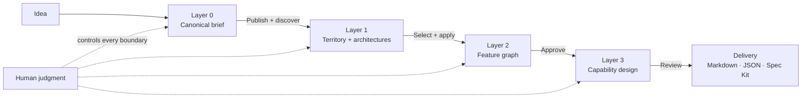
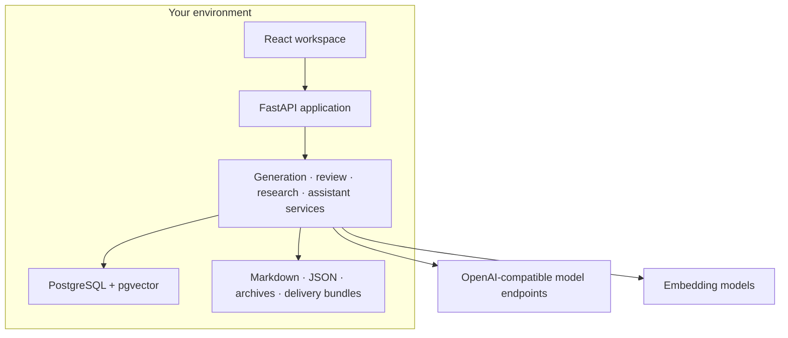

<p align="center">
  <br />
  <strong>STRATA</strong>
  <br />
  <br />
</p>

<h1 align="center">Discover the product before you build it.</h1>

<p align="center">
  Strata expands a core idea across capabilities, dependencies, overlap, and market context—<br />
  then gives you control over what belongs in the product.
</p>

<p align="center">
  <a href="https://github.com/JoeFresco1/Strata/actions/workflows/ci.yml"></a>
  <a href="LICENSE"></a>
  <a href="https://github.com/JoeFresco1/Strata/stargazers"></a>
  <a href="https://github.com/JoeFresco1/Strata/releases"></a>
</p>

<p align="center">
  <a href="#quick-start"><strong>Get started</strong></a> ·
  <a href="#how-strata-works">See how it works</a> ·
  <a href="docs/SELF_HOSTING.md">Self-hosting</a> ·
  <a href="CONTRIBUTING.md">Contribute</a>
</p>

<!-- README HERO MEDIA SLOT
Replace this comment with a real, edge-to-edge workspace screenshot or a 12-18 second
silent product loop. Capture requirements live in docs/README_LAUNCH_PLAN.md.
-->

---

## Most projects discover themselves too late

Most coding tools optimize for execution. Give them a task or a spec and they converge on a plausible implementation. That is useful once the product is understood.

It is a problem when the product is still being discovered.

The model develops the module in front of it. The human does too. Adjacent capabilities go unseen, shared foundations arrive late, and overlapping concepts grow independently. The project reveals what it needed only after implementation has already made those discoveries expensive.

The result is familiar:

- incomplete modules and shallow feature ecosystems;
- duplicated behavior hidden behind different names;
- permissions, settings, search, notifications, imports, and auditability added as afterthoughts;
- inconsistent experiences across features that should have shared a design;
- recurring refactors as the real product slowly becomes visible.

> You end up with the kitchen sink and the mailbox—but no property line.

This is **premature convergence**: committing to one visible product shape before exploring the space around it.

**Strata changes the order of work.**

| The usual path | The Strata path |
| --- | --- |
| Idea → spec → code → discover what is missing → refactor | Idea → explore the design space → compare → select → architect → build |
| The project discovers itself during implementation | The project is deliberately discovered before implementation |
| The model behaves like a task handler | The system searches broadly while the user remains the decision-maker |

> [!IMPORTANT]
> **Strata is designed to exhaust the design space—not the feature count.** The point is not to ship everything it can imagine. The point is to understand the available landscape, including dependencies, alternatives, overlap, synergies, and market context, so you can choose and reject intentionally.

Strata is not a replacement for the product owner or architect. It makes them more informed. Instead of choosing only from the ideas they happened to think of, they choose from a deliberately explored landscape of possibilities.

**The goal is not more software. It is better decisions.**

## What Strata produces

Strata turns a blank project into a reviewable product definition:

- **A canonical brief** — the problem, users, goals, constraints, competitors, and boundaries that downstream work must respect.
- **A pillar model** — the major product responsibilities, broadened deliberately and checked for overlap.
- **A feature graph** — concrete capabilities with ownership, relationships, evidence, ambiguity, and review state.
- **Capability Design Cards** — selectable behaviors, rules, decisions, dependencies, risks, and validation constraints without pretending to be implementation code.
- **A portable handoff** — Markdown, JSON, diagnostics, project archives, and Spec Kit-ready delivery bundles.

The result is not another brainstorm or a mandate to build more. It is a product architecture your team can inspect, challenge, reduce, revise, and build from.

## How Strata works



1. **Frame the idea.** Define the problem, audience, goals, constraints, and known boundaries without pretending the solution is already complete.
2. **Expand the landscape.** Use every required Product Discovery lens to explore attributable product territory before synthesizing multiple pillar architectures.
3. **Expose structure.** Develop pillars into capabilities; surface dependencies, shared foundations, overlap, synergies, and competitive context.
4. **Select intentionally.** Keep, reject, combine, edit, or defer what Strata finds. Nothing advances simply because a model proposed it.
5. **Develop what remains.** Pressure-test selected features and decide behaviors, options, rules, limits, and open questions.
6. **Export the decision trail.** Hand downstream tools and teams a coherent architecture instead of making implementation rediscover the product.

## Designed around control

| Principle | What it changes |
| --- | --- |
| **Exhaust the design space, not the feature count** | Explore what could exist, how it connects, and what it would require before deciding what should exist. |
| **Breadth before depth** | Look across the product surface before overdeveloping the first obvious branch. |
| **Informed human control** | Strata broadens the choice set; people keep, reject, combine, edit, and approve. |
| **One source of truth** | Conversation, forms, research, and generation feed the same durable project model. |
| **Structured generation** | Model output is parsed, validated, repaired, and persisted as product entities—not pasted into a document. |
| **Relationships over lists** | Dependencies, overlap, shared concerns, synergies, and provenance stay attached to the product structure. |
| **Visible decision trail** | Evidence, edits, rejection memory, review state, and run history remain inspectable. |
| **Local first** | Run with local models and local infrastructure; connect remote OpenAI-compatible endpoints only when you choose. |
| **Bounded exploration** | Coverage and stop conditions matter. The goal is informed selection, not endless generation or feature bloat. |

## The workspace

Strata keeps the full product definition in one project rather than splitting each stage into a disconnected tool.

<!-- SCREENSHOT SLOT 1: Project workspace overview, desktop, populated Layer 0-3 project. -->

### Brief

Turn an unstructured idea into a canonical product brief. Plan mode helps interrogate the idea; Form mode gives direct control. Publishing is an explicit decision, not an automatic side effect.

<!-- SCREENSHOT SLOT 2: Layer 0 Plan/Form split with Brief Preview. -->

### Pillars and feature map

Explore the product broadly, then descend into concrete capabilities. Map and table views preserve branch context while overlap review, competitor evidence, and manual editing keep the structure honest.

<!-- SCREENSHOT SLOT 3: Layer 2 map with inspector and a resolved overlap. -->

### Capability design and delivery

Expand approved features into reviewable product behavior. Resolve open decisions, pressure-test assumptions, approve the result, and export a handoff with its lineage intact.

<!-- SCREENSHOT SLOT 4: Layer 3 card and Delivery export side by side. -->

## Built for real product work

- **Manual input stays first-class.** Author Layer 0 and Layer 1 directly, create and edit graph entities, and revise generated capability decisions instead of accepting them wholesale.
- **Optional competitive intelligence.** Run bounded, cited research at the layers where market context changes a decision—or disable it project-wide.
- **Graph-aware review.** Detect duplication and ambiguity without forcing product architecture into a simple tree.
- **Project-aware assistant.** Ask across layers with durable conversations, citations, specialist routing, and confirmation before proposed actions are applied.
- **Operational visibility.** Inspect model calls, token usage, configured remote cost, latency, jobs, health, diagnostics, and replay data by project.
- **Data ownership.** Archive, clone, import, export, retain, clean up, back up, and purge project data explicitly.
- **Flexible model routing.** Assign different OpenAI-compatible LLM endpoints and embedding models to generation, research, review, and assistant workflows.

## Quick start

### Docker Compose

You need [Docker Engine with Compose](https://docs.docker.com/compose/) and an OpenAI-compatible model endpoint.

```bash
git clone https://github.com/JoeFresco1/Strata.git strata
cd strata
cp .env.example .env
docker compose up --build -d
```

Open **http://127.0.0.1:8000** and complete the provider check.

The included Compose stack starts Strata and PostgreSQL with pgvector. By default, Strata expects a model endpoint on the Docker host at `http://host.docker.internal:8080`. Change `LLAMA_BASE_URL`, `STRATA_MODEL_NAME`, and—when required—`STRATA_MODEL_API_KEY` in `.env`.

### Native launchers

<details>
<summary><strong>Windows</strong></summary>

Requires Python 3.12+, Node.js 22+, PostgreSQL 16+ with pgvector, and an OpenAI-compatible model endpoint.

```powershell
Copy-Item .env.example .env
.\start_strata.ps1
```

</details>

<details>
<summary><strong>Linux / macOS</strong></summary>

Requires Python 3.12+, Node.js 22+, PostgreSQL with pgvector, and an OpenAI-compatible model endpoint.

```bash
cp .env.example .env
chmod +x start_strata.sh
./start_strata.sh
```

</details>

For database upgrades, backup and restore, network safety, and model configuration, read the [self-hosting guide](docs/SELF_HOSTING.md). If startup fails, go directly to [troubleshooting](docs/TROUBLESHOOTING.md).

## Your first five minutes

1. Open Strata and connect a model endpoint in the first-run setup.
2. Create a project with a name and a two- or three-sentence idea.
3. In **Layer 0**, use Plan mode to challenge the idea or Form mode to enter known details directly.
4. Review the canonical brief and publish it.
5. In **Layer 1**, publish Product Discovery, run territory exploration, review at least two synthesized architectures, then separately select and explicitly apply the one the product should use. Manual pillars remain available as a first-class path.

From there, Layer 2 turns approved pillars into a feature graph, and Layer 3 turns approved features into explicit capability decisions.

## Model support

Strata talks to endpoints that implement `/v1/models` and `/v1/chat/completions` in the OpenAI API format.

Known paths include:

- `llama.cpp` at `http://127.0.0.1:8080`
- LM Studio at `http://127.0.0.1:1234`
- Ollama's OpenAI-compatible gateway at `http://127.0.0.1:11434/v1`
- hosted providers or gateways that expose the same API and accept a bearer token

Local models avoid per-request API fees and keep prompts on your machine. Remote models may offer more capability or speed. Strata supports separate profiles so that choice can be made per workflow rather than once for the entire project.

## Architecture



The React application and API are served together on port `8000` in production. PostgreSQL is the source of truth. Long-running generation, research, diagnostics, and assistant work use durable jobs with recovery and inspection surfaces.

Read the [production architecture](docs/PRODUCTION_ARCHITECTURE.md), the
[layer architecture](docs/layer%20architecture.md), or the experimental
[Layer 1 territory exploration workflow](docs/LAYER1_TERRITORY_EXPLORATION.md)
for the deeper model and evaluation commands.

For a newcomer-friendly map of the code, runtime entry points, tests, scripts, and documentation, see the [repository guide](docs/REPOSITORY_GUIDE.md).

## Project status and roadmap

Strata is an early self-hosted project. The core Layer 0 → Delivery workflow is implemented and the repository includes CI, migrations, release packaging, diagnostics, backup tooling, and browser QA evidence.

Near-term priorities:

- publish a signed, reproducible `v0.1` release with a versioned upgrade path;
- add a real visual product tour and example project gallery;
- reduce first-run setup to a provider preset and a verified connection;
- publish model-size guidance and repeatable quality benchmarks by workflow;
- harden authenticated trusted-network deployment;
- expand contributor-facing issues, fixtures, and architecture decision records.

See the [changelog](CHANGELOG.md), [completion audit](docs/PLATFORM_COMPLETION_AUDIT.md), and [README launch plan](docs/README_LAUNCH_PLAN.md) for current detail.

## Contributing

Strata is young enough that careful contributions can still shape its foundations.

Good places to help include:

- product-definition and review workflows;
- local model reliability and evaluation;
- graph visualization and accessibility;
- import/export formats and downstream integrations;
- onboarding, fixtures, screenshots, and examples;
- tests for generation boundaries, migrations, and durable jobs.

Start with [CONTRIBUTING.md](CONTRIBUTING.md), open an issue before a large change, and keep pull requests focused. Contributions are licensed under the same [AGPL-3.0](LICENSE) terms as the project; no separate CLA is required.

## FAQ

<details>
<summary><strong>Why local first?</strong></summary>

Product plans contain strategy, constraints, and competitive thinking. Strata should work without sending that material to a hosted service. Local first also keeps the database, model routing, telemetry, and exports under your control. Remote endpoints remain an explicit option.

</details>

<details>
<summary><strong>Does Strata require generation?</strong></summary>

No. Manual authoring is a primary workflow in Layer 0 and Layer 1, and product entities remain editable throughout review. Use a model where exploration helps; keep direct control where the structure is already known.

</details>

<details>
<summary><strong>Can I use OpenAI, Ollama, LM Studio, or llama.cpp?</strong></summary>

Yes, when the endpoint exposes the OpenAI-compatible model-list and chat-completions routes Strata validates during setup. Ollama uses its `/v1` compatibility endpoint. Hosted providers may require a bearer token.

</details>

<details>
<summary><strong>Can I export my work?</strong></summary>

Yes. Strata exports readable Markdown, structured JSON, the Layer 2 graph, approved Layer 3 capability data, diagnostics bundles, portable project archives, and Spec Kit-ready delivery artifacts.

</details>

<details>
<summary><strong>Is Strata ready for a public server or multiple tenants?</strong></summary>

No. Strata currently targets one user or a trusted team on localhost or a private network. It does not provide user accounts or tenant isolation. Add authentication and TLS at a reverse proxy before trusted-network access; do not expose it directly to the public internet.

</details>

<details>
<summary><strong>What does AGPL-3.0 mean for hosted modifications?</strong></summary>

If users interact over a network with your modified version, the AGPL requires you to offer those users the corresponding source under the same license. Read the [license](LICENSE) for the authoritative terms.

</details>

## The long view

Five years from now, success is not Strata writing more plans.

Success is that a team can open any product decision and see where it came from, what it affects, what evidence supported it, what was rejected, and what changed before implementation began. Product architecture becomes a living, inspectable system—not a document that expires the moment work starts.

If that is the kind of tool you want to exist, [star the repository](https://github.com/JoeFresco1/Strata), try it on a real idea, and help shape it.

---

<p align="center">
  <a href="LICENSE">AGPL-3.0</a> ·
  <a href="SECURITY.md">Security</a> ·
  <a href="CODE_OF_CONDUCT.md">Code of Conduct</a> ·
  <a href="CONTRIBUTING.md">Contributing</a>
</p>
