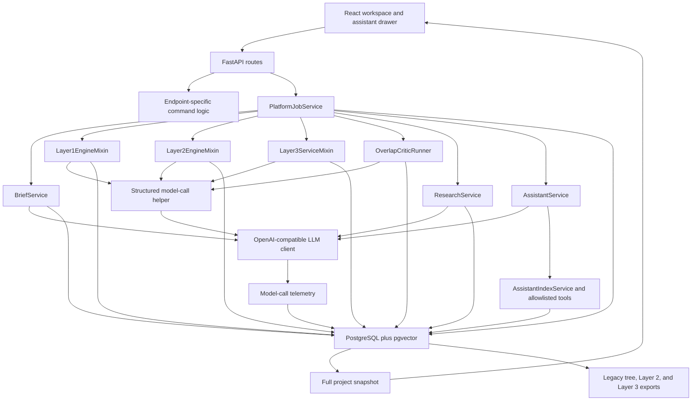
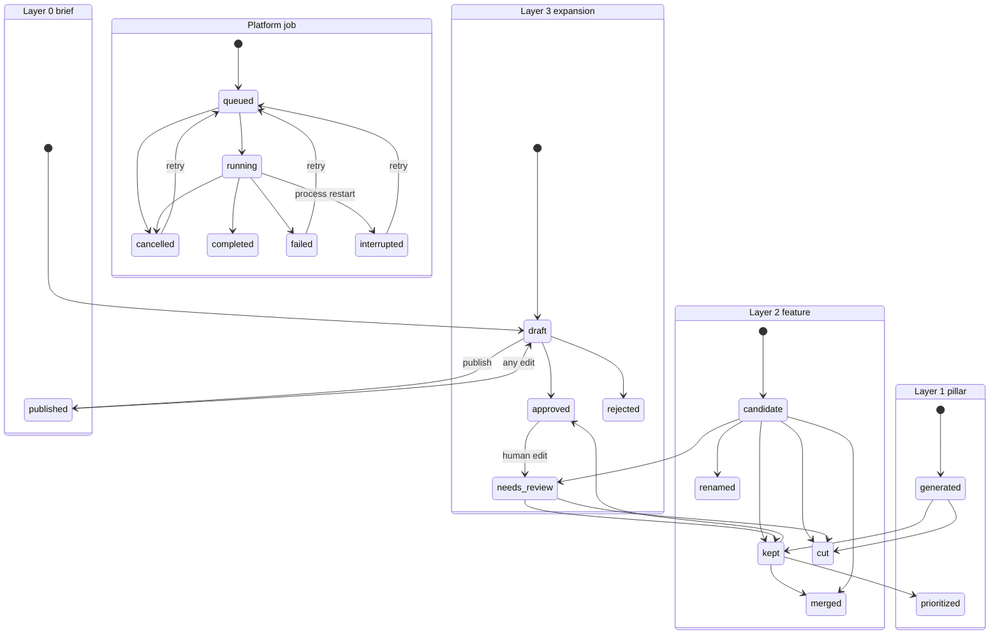
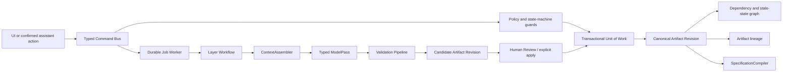

# STRATA Agentic Architecture Review

Date: 2026-07-20  
Review target: working tree at `C:\Users\Fresc\Feature_gen` on `main` (`2138975`)  
Method: read-only execution-path review of the current working tree, including its pre-existing uncommitted changes  
Verification: backend `120 passed, 1 warning, 3 subtests passed`; frontend production build passed with one bundle-size warning

## A. Executive Assessment

### Overall rating: 6/10

STRATA has a stronger foundation than its use of the word "agentic" might suggest. Its core generation paths are not an uncontrolled swarm. They are mostly explicit, bounded pipelines made of generator, normalizer, assessor, critic, retrieval, and persistence passes. Layer gates are deterministic, model outputs are usually typed before entering canonical state, PostgreSQL is the production source of truth, and the overlap reviewer and unified assistant are sensibly constrained.

The architecture is not yet safe enough to call production-ready for long-lived specifications. The largest weakness is not model quality; it is state integrity. A published brief is a mutable single row rather than an immutable revision. Upstream edits do not create a general downstream stale cascade. Layer 3 regeneration overwrites the one current expansion, including human-edited nested content, without a candidate revision or deterministic merge. Multi-record workflows are composed from individually committed database calls, and no shared optimistic-concurrency contract prevents two actions from overwriting the same branch.

What is working:

- Layer 0 publication, Layer 1 keep/prioritize, and Layer 2 approval gates enforce breadth-before-depth in code.
- Layer 1 and Layer 2 use bounded, named passes instead of autonomous recursive agents.
- Layer 2 has explicit scope, granularity, ambiguity, negative-memory, graph, and coverage concepts.
- Raw model calls, telemetry, research, jobs, review actions, assistant runs, and many provenance fields are durable.
- The overlap critic is a good bounded reviewer: shortlist first, typed adjudication second, human resolution last.
- The assistant uses allowlisted read tools and inert mutation proposals with stale-confirmation checks.
- Current automated tests and the frontend build pass.

What is fragile:

- "Published" means a status on a mutable brief row, not a frozen source revision.
- Upstream edits can leave scope contracts, coverage, research, feature expansions, and exports semantically stale without a consistent system-visible state.
- Generation jobs can partially persist before failing; retry is job-level rather than item/checkpoint-level.
- Layer 3 regeneration is destructive to the current artifact and nested identifiers are not code-owned.
- Database operations are individually committed, so compound domain actions are not atomic.
- Context budgets are hard-coded as item or character slices and only partially use model context-window settings.
- Prompt-edited workflows have no placeholder/schema lint at save time.
- The "complete project" export is still a legacy tree export; Layer 2 and Layer 3 are separate artifacts.

What is unnecessarily complex:

- Several components are called agents or sub-agents even though they are fixed model passes or ordinary services.
- Four editable Layer 2 critic prompts are present but are not invoked by the runtime, while a different integrated integrity/graph-critic path performs their responsibilities.
- Legacy tree-mode Layer 2 helpers remain in `GenerationService` even though production docs retire that path.
- The same mutation semantics are reimplemented across endpoints and assistant action execution.

What is missing:

- Immutable source revisions and dependency-based stale propagation.
- Non-destructive regeneration and artifact revision history.
- Atomic command boundaries and optimistic concurrency.
- Item-level generation checkpoints, idempotent retry, and explicit partial-success results.
- A unified provenance link from canonical artifact to job, model call, prompt version, context manifest, and source revision.
- A canonical specification compiler/export that covers Layer 0 through the deepest approved layer.
- Quality benchmark fixtures and failure-injection coverage for the state transitions above.

Suitability for continued development:

Continue development, but do not add L4, collaboration, or more agents before Phase 0 and Phase 1 below. The current architecture should be incrementally refactored. A full rewrite is not justified: the layer engines, graph model, retrieval index, telemetry, and human review concepts are worth keeping.

## B. Current-State Architecture Map

### Architectural character

STRATA is primarily a deterministic workflow application with model-backed passes. Only the unified assistant is meaningfully agent-like: it plans allowlisted reads, optionally invokes specialist roles, synthesizes, and proposes inert actions. The generation engines and critics are pipelines, not autonomous agents. The specialist names are prompt roles executed by the same service, not independent agents with durable memory or authority.

### Implemented components and responsibilities

| Component | Actual responsibility | Inputs | Outputs and persistence | Assessment |
|---|---|---|---|---|
| React client (`frontend/src/App.jsx`, workspace views) | User commands, transient view state, full-snapshot refresh/polling | Forms, selected pillars/features, review actions | API requests; project workspace state | Correct UI boundary, but snapshot-heavy and contains misleading job messaging |
| FastAPI (`strata/api.py` and route modules) | Request validation, endpoint-specific orchestration, snapshots | Pydantic request models | Jobs, direct mutations, full snapshots | Too much domain behavior is duplicated at this boundary |
| `PlatformJobService` | Shared lifecycle vocabulary and in-process job dispatch | Workflow, scope, payload, dedupe key | `platform_jobs`; terminal result/error | Durable record, not a durable worker system |
| `BriefService` | Canonical Layer 0 form/chat updates and publish flag | Current brief, recent chat, user message | One mutable `project_briefs` row; brief conversation | Useful service, but publish/version semantics are insufficient |
| `GenerationService` | Shared LLM runtime, prompt catalog, structured-call/repair helper | Project settings, prompt/context | `generations`, telemetry, validated objects | Good reuse point; still carries retired tree-mode helpers |
| `Layer1EngineMixin` | Explorer/challenger lens loop: generate, normalize, assess, persist, coverage critic | Published brief, approved/rejected memory, pillar representatives | Layer 1 nodes, quarantine/coverage memory, generation/telemetry | Strong bounded pipeline; critic has too much stop authority and provenance is incomplete |
| `Layer2EngineMixin` and mixins | Scope discovery, lens generation, integrity critic, canonical graph creation, graph critic, coverage critic | Kept/prioritized pillars, brief, sibling/cross-pillar memory, negative cache | Layer 2 runs, raw candidates, features, affinities, relationships, coverage, memory | Most mature generation architecture; stale and transaction boundaries are weak |
| `OverlapCriticRunner` | Embedding/lexical shortlist, typed pair adjudication, review artifacts | Active Layer 1 or Layer 2 items | Job items, verdicts, clusters | Appropriately narrow reviewer; should remain a bounded pass |
| `Layer3ServiceMixin` | Whole-feature expansion generation and validation | Approved feature, parent, siblings, edges, existing expansion | One upserted expansion plus action | Simple, but regeneration is destructive and not revision-safe |
| `ResearchService` / `Layer2ResearchMixin` | Competitor discovery, crawl/extract, assessments, evidence | Brief/pillar/feature scope and research settings | Research jobs/sources/chunks/findings/evidence | Service pipeline, not an agent; partial batch handling is better than generation handling |
| `AssistantIndexService` | Content-hashed canonical index and bounded tools | Canonical records, query/scope | Assistant documents, search/tool results | Good project-memory retrieval boundary |
| `AssistantService` | Plan tools, retrieve, optional specialists, synthesize, propose actions | Question, active scope/focus, compacted conversation | Messages, runs, specialists, citations, action proposals | Genuine constrained agent-like component; response contracts and mutation routing need tightening |
| `LlamaCppClient` | OpenAI-compatible JSON/text calls and telemetry | System/user prompts, runtime profile | Parsed JSON/text and `model_calls` | Clear boundary; assumes provider support for OpenAI JSON response format |
| `Database` mixins | Persistence abstraction for PostgreSQL and SQLite tests | Domain writes/reads | Canonical and derived rows | Broad API but every helper opens/commits its own transaction |
| Export functions | Tree export, Layer 2 graph export, Layer 3 manifest | Current database projections | Markdown/JSON files | Fragmented; no single authoritative specification artifact |

### Actual model-call boundaries

| Workflow | Model passes | Validation | Canonical effect |
|---|---|---|---|
| Layer 0 planning | brief extraction, plan guidance | Hand-normalized dictionaries; no strict response model | Extraction updates the canonical mutable brief; fallback writes user text to notes |
| Layer 1 | generation, normalization, assessment, coverage critic | Pydantic response models through structured-call repair | Accepted candidates become Layer 1 nodes before coverage critic |
| Layer 2 | scope discovery, per-lens generation, integrity critic, graph critic, coverage critic | Pydantic response models; some critic failures fall back to empty/default results | Raw candidates and canonical features persist incrementally; critics add review state/edges/memory |
| Project overlap | one or two adjudications per shortlisted item | Strict `OverlapCriticResponse` plus ID filtering | Verdicts/clusters only; user resolves high-impact actions |
| Layer 3 | one expansion call per selected feature | Pydantic, normalization, overlap-ID check, implementation-leakage regex | Upserts the one current expansion for each feature |
| Research | competitor discovery and pillar/feature assessments | Workflow-specific normalization/fallback | Research evidence/findings persist |
| Assistant | query planner, zero or more specialists, synthesis, optional compaction | JSON parsing plus allowlist/citation/action filters; no strict planner/synthesis models | Answer/citations persist; mutations remain proposals until confirmation |

### State transitions

Architectural gates are real:

- Layer 1 requires `brief.status == "published"` (`strata/generation.py:170-175`).
- Layer 2 requires selected Layer 1 pillars to be `kept` or `prioritized` (`strata/layer2_memory.py:63-70`).
- Layer 3 requires selected Layer 2 features to be `approved` (`strata/api_support.py:555-578`, `strata/layer3_service.py:62-67`).
- Layer 3 approval/export rechecks that the Layer 2 source is still approved (`strata/api.py:785-805`, `strata/api_export.py:49-75`).

The missing transition is a general `current -> stale -> reconciled` lifecycle for derived artifacts when an authoritative ancestor changes.

### Persistence boundaries

- Canonical: projects, one current brief, Layer 1 nodes, Layer 2 features/relationships, one current Layer 3 expansion per feature, user review states.
- Derived but persisted: scope contracts, coverage memory/matrices, embeddings, overlap clusters, assistant documents/summaries, research findings.
- Operational: platform jobs, research jobs, assistant runs, specialist runs.
- Audit/provenance: generations, model calls, Layer 2 raw candidates/runs/review actions, Layer 3 actions/provenance.
- UI projection: `GET /api/projects/{project_id}` eagerly assembles all major domains into one response (`strata/api_support.py:177-234`).

## C. Findings

### F-01 — Critical — Published inputs are mutable and downstream staleness is not modeled

Relevant code: `BriefService.update_brief()` and `publish()` (`strata/brief.py:80-85`, `129-134`); `Database.upsert_project_brief()` (`strata/db.py:173-257`); `project_briefs` unique `project_id` (`strata/db_schema_postgres.py:36-51`); node edit behavior (`strata/api.py:530-554`).

Current behavior: publishing changes the status on the one brief row. Editing that row changes it back to draft. No immutable published revision is retained. Pillar edits mark only Layer 1 research stale. Layer 2 scope contracts, coverage, features, Layer 3 expansions, and exports have no common dependency revision or stale state.

Why this is a problem: the system cannot prove which published brief produced an artifact, reliably compare old and new decisions, or prevent export of semantically obsolete descendants. The brief ID remains the same across materially different content.

Threatened goals: traceability, recoverability, human control, coherent export, consistent behavior across layers.

Recommended correction: introduce immutable `project_revisions`/`brief_revisions`; give each canonical artifact a `source_revision_id` and `content_revision`; record dependency edges; mark descendants stale on upstream change without rewriting them. Publication should select an immutable revision. Reconciliation should be explicit.

Timing: required now, before deeper layers.

### F-02 — Critical — Layer 3 regeneration can overwrite human work

Relevant code: existing expansion is sent back through the model (`strata/layer3_service.py:78-107`); normalized nested IDs accept model values or generate new UUIDs (`149-210`); the result upserts the current row (`111-138`); database conflict update replaces every expansion field (`strata/layer3_db.py:19-66`).

Current behavior: regenerating a feature runs the model against the current expansion and replaces feature intent, groups, options, overlap review, questions, review state, and provenance. The prompt asks the model to preserve clear prior state, but code does not preserve human-edited fields, selection states, or nested IDs deterministically. There is no prior revision to restore.

Why this is a problem: a valid model response can silently erase or reshape reviewed content. This is a quality-success/technical-success path that still causes data loss.

Threatened goals: human edits outrank generated content, scoped regeneration, stable IDs, rollback, recoverability.

Recommended correction: save regeneration as an immutable candidate revision. Diff it against the active expansion. Preserve existing group/option IDs and human-owned fields in code. Let the user accept per section or replace explicitly. Retain every prior revision and before/after action payload.

Timing: required now.

### F-03 — High — Compound workflows are not atomic and updates have no optimistic-concurrency guard

Relevant code: every database helper opens and commits its own connection (`strata/db.py:75-88`, `920-947`); Layer 2 review/merge performs relationship, feature, and action writes separately (`strata/api_support.py:428-513`); Layer 3 update uses `UPDATE ... WHERE id` with no expected version (`strata/layer3_db.py:94-107`); Layer 2 update does the same (`strata/layer2_db.py:211-265`).

Current behavior: a domain action is a chain of independently committed writes. Two clients can update the same record last-write-wins. A mid-command error can leave an edge without its intended status/action record, or a changed artifact without its audit entry.

Why this is a problem: application correctness depends on every later write succeeding and on users not editing concurrently.

Threatened goals: transaction safety, collaboration readiness, auditability, reliable rollback.

Recommended correction: add a database unit-of-work/transaction API and domain command services. Add `revision` columns and require expected revisions on writes. Return `409 Conflict` with a merge/reload response when revisions differ.

Timing: Phase 0 for destructive/review commands; Phase 1 everywhere.

### F-04 — High — Job records are durable, but execution and retry are not checkpoint-safe

Relevant code: jobs run through FastAPI `BackgroundTasks` or daemon threads (`strata/api.py:103-125`, `251-311`, `435-525`, `556-603`, `724-745`); the service uses a process-local semaphore (`strata/jobs.py:38-41`); cancellation is checked only at coarse workflow checkpoints (`141-145`); Layer 2 records partial created IDs on failure (`strata/layer2_engine.py:48-86`); retry reuses the whole job (`strata/db_jobs.py:160-176`).

Current behavior: a process restart marks running work interrupted. Queued work is restarted in-process. Generation loops persist incrementally, but the platform job has one terminal result. A Layer 2 or Layer 3 batch can persist early items and then fail; retry reruns the whole request. Cancellation cannot interrupt most model passes or inner loops promptly.

Why this is a problem: "durable job" overstates the guarantee. Partial success is not a first-class outcome, and retry can create additional candidates or re-overwrite Layer 3.

Threatened goals: recoverability, failure containment, predictable partial regeneration, background execution.

Recommended correction: keep `platform_jobs` but add leased worker execution, heartbeats, per-item/checkpoint rows, idempotency keys for artifact writes, explicit `partial` status, and resume-from-checkpoint. A single-process worker is sufficient initially; no distributed queue is required.

Timing: Phase 1.

### F-05 — High — Mutation rules are duplicated and produce different behavior by entry point

Relevant code: HTTP node edits refresh semantic metadata and mark research stale (`strata/api.py:530-554`), while confirmed assistant `update_node` calls `db.update_node()` directly (`strata/api_support.py:599-605`). Assistant `update_brief` omits the canonical `problem` field (`589-598`). Assistant generation/research commands construct their own job payloads/dedupe keys (`624-696`).

Current behavior: the same conceptual action has different side effects depending on whether it comes from the workspace or assistant. Some paths record review actions; inline feature edit does not. Business rules live across route handlers, helpers, and services.

Why this is a problem: hidden coupling makes layer behavior inconsistent and makes future permissions/stale propagation impossible to enforce centrally.

Threatened goals: consistent behavior, human control, testability, clear component responsibility.

Recommended correction: create typed application commands such as `UpdateBrief`, `UpdatePillar`, `UpdateFeature`, `ReviewFeature`, and `RequestGeneration`. HTTP, assistant confirmation, import, and future collaboration must call the same command handler.

Timing: required in Phase 0 for brief/pillar/feature mutations; finish in Phase 1.

### F-06 — High — Generated reviewers and cached scope can affect authoritative state without source freshness guarantees

Relevant code: a cached Layer 2 scope contract is reused indefinitely when it still parses (`strata/layer2_critics.py:31-103`); graph critic directives may mark any valid project feature `needs_review`, not only current-round candidates (`200-222`); coverage critic can mark listed features `needs_review` (`strata/layer2_coverage.py:145-158`).

Current behavior: changing a pillar does not invalidate its scope contract. A model critic can downgrade an already kept/approved feature because IDs are checked for existence, not ownership by the current generation pass or human-state protection.

Why this is a problem: model advice can outrank prior human decisions, and stale derived memory can steer later generation as though it were authoritative.

Threatened goals: human edits outrank generation, authoritative-state distinction, context freshness, predictable regeneration.

Recommended correction: fingerprint every derived memory packet against source revisions and prompt/model policy. Recompute or mark stale when the fingerprint changes. Critics should emit findings only; deterministic policy may auto-route only new unreviewed candidates. Human-approved artifacts require explicit user resolution.

Timing: required now for human-state protection; fingerprinting in Phase 1.

### F-07 — High — Context assembly is bounded, but not governed by a shared token-budget policy

Relevant code: Layer 1 keeps at most 24 representative families and challengers see a positional slice (`strata/layer1_engine.py:461-488`, `636-656`); Layer 2 takes the first 40 sibling/cross-pillar features and 40 negative-cache items (`strata/layer2_memory.py:72-119`); Layer 3 sends all active siblings but hard-caps output at 900 tokens (`strata/layer3_service.py:69-107`); assistant synthesis/specialists use fixed character truncation (`strata/assistant_service.py:275-303`, `324-354`); only assistant compaction uses profile `context_window` (`378-432`).

Current behavior: larger API windows are only partly used, while large local projects can lose the most relevant cross-branch items because selection is positional rather than relevance/priority based. No workflow reserves tokens for schema, instructions, output, or repairs.

Why this is a problem: context can be too small, too large, or cut at arbitrary boundaries, and behavior changes with database ordering rather than semantic relevance.

Threatened goals: context efficiency, reliable local-model performance, scalability, consistent quality.

Recommended correction: introduce one `ContextAssembler` with workflow budgets derived from profile context window and output reserve. Each context packet should carry source IDs/revisions and priority classes: authoritative ancestor, active item, reviewed siblings, relevant cross-branch neighbors, negative memory, research. Use deterministic selection plus embeddings where helpful; store a context manifest.

Timing: Phase 1.

### F-08 — High — Export is fragmented and can publish semantically stale content

Relevant code: the main export includes only `Project` plus legacy `nodes` tree (`strata/api_export.py:17-29`, `strata/export.py:29-52`); Layer 2 and Layer 3 use separate endpoints (`strata/api_export.py:31-86`); Layer 3 stale checking tests only current Layer 2 approval status (`63-75`); its lineage includes only a partial Layer 0 brief (`strata/export.py:123-175`).

Current behavior: there is no single canonical Layer 0→Layer 3 specification export. The main export omits the canonical brief, graph-native Layer 2, and Layer 3. Layer 3 export cannot detect a changed-but-still-approved feature or changed pillar/brief.

Why this is a problem: the product's final artifact can be incomplete or internally inconsistent even when every exported row has a valid status.

Threatened goals: structured coherent export, traceability, stale prevention.

Recommended correction: create a deterministic `SpecificationCompiler` over selected immutable revisions. Validate all dependency revisions and approval gates before export. Produce one versioned manifest, then render Markdown/JSON/other formats from that manifest.

Timing: Phase 0 stale gate; Phase 1 compiler.

### F-09 — Medium — Structured-output enforcement is inconsistent and semantic validation is shallow

Relevant code: main generation validators use Pydantic and repair (`strata/generation.py:264-352`), but assistant plan/synthesis/specialists consume parsed dictionaries directly (`strata/assistant_service.py:219-303`, `305-376`); model classes do not forbid extra fields; Layer 3 normalization does not enforce unique/stable nested IDs or validate textual dependencies (`strata/layer3_service.py:149-228`).

Current behavior: syntactic JSON is broadly enforced, but not every response has a strict application schema. Missing assistant fields silently degrade to fallback text. Extra fields are ignored. Coverage evidence IDs, critic completeness, nested ID uniqueness, contradictions, and dependencies are only partly checked.

Why this is a problem: technically valid JSON can carry incomplete or semantically inconsistent results into memory or state.

Threatened goals: structured valid outputs, semantic integrity, reliable recovery.

Recommended correction: define strict `extra="forbid"` response models for every model call, including assistant roles and research. Add semantic validators that check required item coverage, unique IDs, known references, state invariants, and cross-field contradictions. Repair only schema-shape failures; route quality failures to review rather than blind retry.

Timing: Phase 1.

### F-10 — Medium — Provenance exists in pieces but is not a complete artifact lineage

Relevant code: raw generation logs store prompt/response/model but no workflow, run, prompt key, or resulting artifact IDs (`strata/db.py:627-662`); telemetry stores full prompt and hash (`strata/llm.py:279-344`); Layer 1 stores source model/lens only (`strata/layer1_engine.py:507-521`); Layer 2 features reference raw candidates; Layer 3 stores selected source IDs/model but overwrites provenance on regeneration (`strata/layer3_service.py:111-138`).

Current behavior: developers can inspect calls, runs, raw candidates, and artifacts, but joining "this exact item" to "this exact call/context/source revision" is not uniformly possible.

Why this is a problem: the observability questions in the review brief cannot all be answered reliably, especially after regeneration or prompt edits.

Threatened goals: provenance, auditability, benchmarking, replay.

Recommended correction: add `artifact_generations` linking artifact revision, platform job/checkpoint, model call, prompt key/version/hash, context manifest, source revisions, validation result, retry/repair chain, and actor. Keep telemetry retention policy separate from lineage metadata.

Timing: Phase 2, after revision IDs exist.

### F-11 — Medium — Prompt catalog safety and untrusted-content boundaries are under-specified

Relevant code: prompt rendering is raw `str.replace()` with no required/unknown placeholder check (`strata/prompts.py:63-84`); settings accept arbitrary non-empty prompt keys/text (`strata/project_settings.py:363-375`); project/user/research content is interpolated directly; the system prompt does not explicitly label embedded project text as untrusted data (`prompts.json`, `system_json_generator`).

Current behavior: a user can save an edited prompt with missing or misspelled placeholders. User-entered project content can contain instructions that compete with workflow instructions. ID/schema filters limit damage, but quality and critic routing can still be manipulated.

Why this is a problem: prompt editing can break a workflow only when it is run, and prompt injection can bias generated or reviewer output.

Threatened goals: prompt reliability, model independence, authoritative-state separation.

Recommended correction: define a prompt manifest containing required variables, response schema, owner workflow, and version. Validate the full catalog on load/save. Serialize untrusted content in clearly delimited JSON/data blocks and instruct models that it is evidence, never instructions. Add injection regression fixtures.

Timing: Phase 1.

### F-12 — Medium — Snapshot polling and health/job messaging obscure real runtime state

Relevant code: full snapshot assembly (`strata/api_support.py:177-234`); frontend polls it every two seconds while any job is active (`frontend/src/App.jsx:208-234`); bootstrap labels model-only `/health` as "Local model ready" (`frontend/src/App.jsx:120-137`, `strata/api.py:136-140`); Layer 2 immediately overwrites "queued" with "generated" (`frontend/src/App.jsx:433-462`).

Current behavior: job progress refresh reloads brief, nodes, memory, research, Layer 2 graph, overlap, Layer 3, and settings. Readiness is reduced to model reachability on startup even though `admin-health` has broader signals.

Why this is a problem: large projects scale poorly and users can be told work completed when it only queued.

Threatened goals: observability, scalability, recoverability UX.

Recommended correction: use job-specific polling or server-sent events, then refresh only invalidated domain projections. Distinguish API/database/provider readiness. Derive user messages from durable job state.

Timing: Phase 2; fix the incorrect message immediately.

### F-13 — Low — Retired and dormant "agent" surfaces create architectural ambiguity

Relevant code: tree-mode Layer 2 helpers are unreferenced (`strata/generation.py:212-221`); `_layer2_scope_contract()` is unreferenced (`strata/layer2_coverage.py:18-39`); editable prompts `layer2_granularity_critic`, `layer2_shared_concern_critic`, `layer2_ambiguity_critic`, and `layer2_negative_cache_critic` are exposed in `prompts.json`/`PromptCatalogEditor.jsx` but not called by runtime code.

Current behavior: documentation and settings imply more agents than actually execute. Similar concerns are implemented by the integrated integrity/graph/negative-cache pipeline.

Why this is a problem: maintainers cannot tell which prompt changes affect production behavior and may preserve obsolete concepts.

Threatened goals: understandable architecture, minimal unnecessary agent complexity.

Recommended correction: remove dormant prompt/editor entries and dead helpers, or mark them explicitly experimental and wire them through a tested registry. Prefer capability names such as "integrity pass" over "agent" unless a component plans/uses tools autonomously.

Timing: Phase 1 cleanup.

### F-14 — Medium — Tests are strong on current helpers but weak on architectural failure modes and output quality

Relevant code: `tests/core_*_cases.py`; current verification result recorded at the top of this review.

Current behavior: tests cover routing, gates, normalization, overlap, provider onboarding, jobs, archive, assistant allowlists, and many API contracts. Missing coverage includes concurrent updates, transaction rollback, stale propagation, non-destructive regeneration, stable nested IDs, generation partial retry, prompt-catalog contract lint, context budget allocation, prompt injection, and cross-layer quality benchmarks.

Why this is a problem: the current suite can pass while the Critical/High state-integrity defects remain.

Threatened goals: testability, reliability, measurable quality.

Recommended correction: add deterministic state-machine and failure-injection tests first; then add versioned model-response fixtures and an opt-in model benchmark suite measuring coverage, duplication, layer fit, naming consistency, and lineage coherence.

Timing: Phase 0 tests for every immediate fix; broader benchmarks in Phase 3.

## D. Target Architecture

### Recommendation: a small deterministic workflow kernel with model-pass adapters

Do not create more agents. Keep one agent-like project assistant and treat generation/review roles as typed model passes inside explicit workflows.

### Component boundaries

1. **Command handlers** own mutations and are the only write entry point. Routes, assistant confirmations, imports, and future clients invoke them.
2. **State-machine/policy service** owns valid transitions, approval gates, human-ownership rules, permissions, and stale propagation.
3. **Workflow definitions** own deterministic sequencing, limits, checkpoints, and retry behavior for each layer.
4. **ContextAssembler** owns scoped retrieval, token budgets, source priority, source revisions, and context manifests.
5. **ModelPass** owns one prompt key, strict input/output models, runtime profile, and repair policy.
6. **Validation pipeline** separates parse/schema, reference/invariant, and quality/rubric results.
7. **Artifact revision store** owns immutable generated candidates and canonical accepted revisions.
8. **Job worker** owns leases, heartbeats, checkpoints, cancellation, partial results, and resume.
9. **SpecificationCompiler** owns one validated intermediate manifest and format renderers.
10. **Assistant** keeps allowlisted reads and inert actions, but delegates confirmed commands to the same handlers as the UI.

### Target state model

Minimum common fields for canonical artifacts:

- `artifact_id`: stable logical identity.
- `revision_id`: immutable revision identity.
- `revision_number` and `content_hash`.
- `source_revision_ids` and explicit dependency kinds.
- `origin`: human, model, import, system.
- `actor_id`/actor type.
- `review_state`: draft, needs_review, approved, rejected.
- `freshness_state`: current, stale, superseded.
- `human_owned_fields`: fields a regeneration may not replace automatically.
- `created_at`, `superseded_at`.

The current projection tables may remain for fast reads during migration, but accepted content must be reconstructable from revisions and commands.

### Target orchestration

- Layer 0: edit draft revision → publish immutable revision → stale descendants of the previously published revision.
- Layer 1: deterministic required-lens schedule → typed generate/normalize/assess → candidate revisions → deterministic duplicate checks → human review. A model critic may advise continuation, but cannot stop before minimum required lens coverage.
- Layer 2: selected approved pillars → source-fingerprinted scope contracts → per-pillar/per-lens checkpoints → raw candidates → integrity/graph findings → candidate features → human review.
- Layer 3+: one selected parent artifact → section-addressable generation → candidate revision/diff → explicit apply. Deeper layers use the same generic parent/child dependency contract, not copy-pasted endpoints.
- Overlap: keep the current shortlist/adjudicate/review architecture.
- Assistant: keep plan/read/synthesize/propose, but validate every response and call command handlers after confirmation.

### Context strategy

For every call, allocate:

1. system and schema reserve;
2. output reserve;
3. active authoritative lineage;
4. current artifact and human-owned constraints;
5. most relevant reviewed siblings/graph neighbors;
6. negative/rejection memory;
7. critic/research evidence;
8. optional summaries.

Context selection must be deterministic at equal scores, source-revision aware, and persisted as a manifest of source IDs, hashes, truncation decisions, and estimated tokens. Local profiles may use smaller evidence packets; remote profiles may widen the same policy without changing semantics.

### Validation pipeline

1. Technical failure: timeout/provider/unavailable → bounded retry with backoff or pause job.
2. Parse failure: invalid JSON → one JSON repair pass using captured raw output.
3. Schema failure: strict typed mismatch → targeted repair with validation errors.
4. Reference/invariant failure: unknown IDs, duplicate nested IDs, invalid state, wrong owner → reject without canonical write; repair only if safe.
5. Quality failure: valid but weak/duplicate/off-layer → persist as candidate/finding with rubric scores and human review; do not repeat blindly.
6. Conflict failure: source revision changed → mark job result stale/conflicted and require rebase/rerun.

### Retry and recovery

- Retry individual model passes or selected batch items, not the entire workflow by default.
- Each checkpoint is idempotent and records its source revision/context hash.
- Completed items remain completed; failed items can resume.
- Generation never replaces the active human-reviewed revision without an explicit apply command.
- Rollback selects an earlier artifact revision; it does not reverse-engineer old state from sparse action logs.

### Quality control

- Deterministic: schema, ID/reference integrity, layer gates, status transitions, exact/normalized duplicates, required coverage accounting.
- Embedding/lexical: candidate shortlist and similarity evidence, never final high-impact authority.
- Model reviewer: bounded artifact critic with explicit verdict taxonomy and no direct mutation of human-approved state.
- User: final keep/cut/merge/approve and regeneration-diff acceptance.
- Benchmarks: fixed project fixtures and rubric scoring tracked by model/prompt version.

### What remains, changes, and is removed

Remain:

- PostgreSQL/pgvector, current layer-specific data, raw candidates, research evidence.
- Layer 1 and Layer 2 bounded multi-pass algorithms.
- Overlap shortlist/reviewer workflow.
- Unified assistant tools, citations, and confirmation model.
- Prompt catalog as an editable external resource.
- Platform jobs and telemetry tables as foundations.

Refactor:

- Route/assistant mutations into command handlers.
- Platform job execution into a leased, checkpointed worker.
- Brief and Layer 3 storage into revisioned artifacts.
- Generation context into a shared assembler.
- Structured calls into a registry of strict typed model passes.
- Exports into a compiler plus format renderers.

Remove:

- Retired tree-mode Layer 2 helpers.
- Dormant prompt/editor entries or the implication that they are active agents.
- Direct database writes from routes/assistant actions for domain mutations.
- Destructive whole-artifact regeneration.
- Full-snapshot polling for job progress.

Introduce:

- Artifact/source revisions, dependency/stale graph, optimistic concurrency.
- Unit of work and typed command handlers.
- Context manifests and artifact-generation lineage.
- Checkpointed job items and explicit partial status.
- Strict prompt/model-pass registry and catalog lint.
- Canonical specification compiler.

## E. Prioritized Improvement Plan

### Phase 0 — Immediate correctness and data-integrity fixes

| Task | Objective | Affected systems | Dependencies | Acceptance criteria | Risk | Benefit |
|---|---|---|---|---|---|---|
| P0.1 Brief revisions and stale cascade | Freeze published Layer 0 and mark descendants stale | brief service/schema, Layer 1/2/3, export | migration | Editing a published brief creates a draft revision; old published revision remains; descendants show stale; no silent rewrite | High | Restores source-of-truth semantics |
| P0.2 Non-destructive Layer 3 regeneration | Preserve all human edits and IDs | Layer 3 service/schema/API/UI | artifact revisions | Regeneration creates a candidate diff; active expansion is unchanged until explicit apply; rollback works | High | Prevents data loss |
| P0.3 Canonical mutation commands | Eliminate divergent side effects | API support, brief/node/feature review, assistant actions | command interfaces | UI and assistant produce identical state/audit/stale effects; `problem` is supported everywhere | Medium | Consistency and testability |
| P0.4 Transaction and revision guards | Make critical commands atomic and conflict-aware | database abstraction, review/update routes | unit-of-work API | Injected failure rolls back all command writes; stale `expected_revision` returns 409; no lost update | High | Data integrity and collaboration base |
| P0.5 Export freshness gate | Block semantically stale output | exports, dependency revisions | P0.1 | Export identifies exact stale dependencies and cannot publish mixed revisions | Medium | Coherent product artifact |
| P0.6 Protect human approvals from critics | Make critics advisory on reviewed state | Layer 2 critics/coverage | command policy | Critics may create findings but cannot downgrade human-approved features automatically | Low | Human authority |

### Phase 1 — Architectural stabilization

| Task | Objective | Affected systems | Dependencies | Acceptance criteria | Risk | Benefit |
|---|---|---|---|---|---|---|
| P1.1 Checkpointed job worker | Resume generation safely | jobs, generation engines, startup | P0.2/P0.4 | Lease/heartbeat/checkpoints; process restart resumes or cleanly pauses; partial items visible; retry is item-scoped | High | Reliable background work |
| P1.2 ContextAssembler | Apply profile-aware budgets consistently | all model workflows | source revisions | Every call has an inspected context manifest; no raw positional truncation; tests cover small/large windows | Medium | Local-model reliability |
| P1.3 Typed ModelPass registry | Centralize schema/prompt/runtime/repair rules | prompts, generation, assistant, research | none | Every model call maps to one registered strict input/output contract and prompt version | Medium | Understandability and validation |
| P1.4 Source-fingerprinted derived memory | Prevent stale scope/coverage/retrieval | project memory, scope contracts, index | P0.1 | Derived packets expose source hash/revision and are recomputed or marked stale on mismatch | Medium | Context correctness |
| P1.5 SpecificationCompiler | Produce one coherent manifest | export, schemas | P0.1/P0.5 | One manifest includes full brief, approved pillars/features/deep artifacts, provenance, and freshness; Markdown/JSON derive from it | Medium | Product completion |
| P1.6 Remove dormant architecture | Align names, prompts, code, docs | generation helpers, prompts editor, docs | registry inventory | No editable prompt is presented as active unless registered; retired helpers removed with tests passing | Low | Lower cognitive load |

### Phase 2 — Reliability and observability

| Task | Objective | Affected systems | Dependencies | Acceptance criteria | Risk | Benefit |
|---|---|---|---|---|---|---|
| P2.1 Artifact lineage | Answer every provenance question | telemetry, generations, artifacts | revisions/model-pass registry | From an artifact revision, one query returns job, call, prompt version, model, context manifest, repairs, actor, and sources | Medium | Audit/replay/debug |
| P2.2 Job events and targeted refresh | Replace full-snapshot polling | API/frontend | worker checkpoints | UI observes progress without full snapshot reload; only affected domains refresh; messages reflect durable status | Medium | Scale and UX clarity |
| P2.3 Failure taxonomy | Separate technical/schema/quality/conflict outcomes | jobs, model passes, UI | validation pipeline | Failures have stable codes and recovery actions; Analytics groups them correctly | Low | Operational clarity |
| P2.4 Failure-injection suite | Prove recovery invariants | tests/CI | P0/P1 | Tests cover interruption after every checkpoint/write, provider timeout, malformed/weak output, and conflicts | Medium | Confidence in recovery |

### Phase 3 — Quality improvements

| Task | Objective | Affected systems | Dependencies | Acceptance criteria | Risk | Benefit |
|---|---|---|---|---|---|---|
| P3.1 Versioned quality fixtures | Measure coverage and decomposition quality | tests/evals | lineage/model-pass registry | Fixed projects score distinctness, coverage, layer fit, duplication, naming, and coherence by prompt/model version | Low | Measurable model value |
| P3.2 Calibrated reviewer policy | Use model critics only where they add value | Layer 1/2/3 review | benchmarks | Reviewer retained only when it improves benchmark metrics above agreed threshold; no reflection loops by default | Low | Less cost and drift |
| P3.3 Section-level deeper generation | Add safe partial regeneration | Layer 3+ workflow | revisions/context assembler | User can regenerate one group/branch; unrelated IDs/content remain byte-for-byte unchanged | Medium | Predictable refinement |
| P3.4 Prompt injection and drift regression | Harden editable prompts/content | prompt registry/tests | P1.3 | Full catalog validates on load/save; adversarial content cannot escape schema/tool/action boundaries in fixtures | Low | Prompt reliability |

### Phase 4 — Optional future capabilities

| Task | Objective | Affected systems | Dependencies | Acceptance criteria | Risk | Benefit |
|---|---|---|---|---|---|---|
| P4.1 Generic L4+ artifact types | Extend depth without copied architecture | artifact/workflow registry | all earlier phases | New child type registers schema/context/review/export rules without new orchestration framework | Medium | Extensibility |
| P4.2 Project branching | Explore alternatives safely | revisions/dependencies/compiler | revision model | Branch, compare, merge with conflicts and lineage | High | Product exploration |
| P4.3 Collaborative editing | Multi-user commands and permissions | auth, concurrency, audit | optimistic concurrency | Actor-aware audit, conflict handling, permissions | High | Collaboration |
| P4.4 Streaming/provider adapters | Improve responsiveness and provider range | model client/jobs/UI | typed passes/job events | Provider capabilities negotiated; streaming does not weaken structured final validation | Medium | UX/provider flexibility |
| P4.5 Import adapters and format renderers | Reuse existing specs and export broadly | compiler/revisions | canonical manifest | Imports create reviewed candidate revisions; renderers never own canonical logic | Medium | Interoperability |

## F. Architecture Decision Records

### ADR-001 — Use explicit workflows, not an agent swarm

Decision: keep one constrained project assistant; implement generation and review as deterministic typed model passes.

Context: STRATA needs breadth, decomposition, and synthesis, but workflow/state integrity must remain deterministic and local-model friendly.

Alternatives considered: autonomous manager with spawned agents; separate persistent agent per layer; current bounded pipelines.

Chosen approach: explicit layer workflows with bounded passes and human checkpoints.

Consequences: orchestration stays testable; models can be swapped; fewer emergent failures. Workflow code must explicitly define sequence and stop policy.

Migration: rename pass-like "agents" where helpful; register existing passes without changing their prompts initially.

### ADR-002 — Make canonical artifacts immutable revisions

Decision: logical artifacts have stable IDs and immutable revisions; publication/approval selects an active revision.

Context: mutable brief/Layer 3 rows cannot support provenance, stale detection, rollback, branching, or safe regeneration.

Alternatives considered: sparse action log; periodic snapshots; immutable revisions.

Chosen approach: immutable revisions plus current projections for fast reads.

Consequences: more rows and migration work, but simple rollback and precise dependency tracking.

Migration: seed revision 1 from each current artifact; keep existing IDs as logical artifact IDs; backfill source revision where inferable and label unknown lineage explicitly.

### ADR-003 — Treat regeneration as a candidate, never an overwrite

Decision: model regeneration produces a candidate revision/diff.

Context: human edits must outrank model output and partial regeneration must be isolated.

Alternatives considered: prompt-only preservation; field-level protected flags on mutable rows; candidate revisions.

Chosen approach: candidate revision with code-owned ID matching and explicit apply.

Consequences: adds a review step but prevents silent loss. Fully automatic regeneration remains possible only for unreviewed generated drafts.

Migration: first apply to Layer 3, then any future deeper artifact.

### ADR-004 — Centralize all mutations in typed command handlers

Decision: routes and assistant actions call the same command layer.

Context: current paths duplicate validation, stale marking, job payloads, and audit behavior.

Alternatives considered: keep route helpers; have assistant call HTTP internally; shared command service.

Chosen approach: in-process typed command handlers under transactional unit of work.

Consequences: consistent semantics and easier permissions/testing; route code becomes thin.

Migration: move brief, node, feature review, and generation-request commands first.

### ADR-005 — Keep the job table and add a leased single-process worker

Decision: evolve `platform_jobs`; do not introduce Redis/Celery yet.

Context: self-hosted/local-first deployment needs restart safety without operational sprawl.

Alternatives considered: FastAPI background tasks; external broker/worker; database-leased worker.

Chosen approach: database leases, heartbeat, checkpoints, and one worker process/thread by default.

Consequences: adequate local durability with low deployment complexity; database polling must be bounded.

Migration: support old queued jobs as non-checkpointed version 1; new workflows write versioned checkpoint plans.

### ADR-006 — Introduce one profile-aware ContextAssembler

Decision: all model workflows request a typed context packet from one budgeting service.

Context: current workflows mix positional item caps, fixed character slices, and partial context-window use.

Alternatives considered: tune each prompt independently; always use maximum context; shared assembler.

Chosen approach: shared budget policy with workflow-specific source priorities.

Consequences: predictable local/API behavior and inspectable context; requires source metadata and token estimation.

Migration: assistant and Layer 3 first, then Layer 2 and Layer 1.

### ADR-007 — Compile one canonical specification manifest

Decision: export formats derive from one validated manifest across all approved layers.

Context: current main, Layer 2, and Layer 3 exports represent different partial products.

Alternatives considered: continue per-layer exports; concatenate files; compile canonical manifest.

Chosen approach: compiler plus renderers.

Consequences: one coherence/stale gate and easier new formats; per-layer exports can remain diagnostic views.

Migration: implement manifest v2 alongside existing endpoints, then make it the primary export.

## G. Final Recommendation

Incrementally refactor STRATA. Keep the current layer engines, graph-native Layer 2 model, overlap reviewer, research evidence pipeline, assistant retrieval/tools, PostgreSQL/pgvector, telemetry, and human approval gates. Replace the mutable artifact/regeneration behavior, centralize mutations, and redesign the execution layer around revision-aware commands and checkpointed jobs.

Do not perform a larger architectural rewrite. The system's core decomposition approach is sound and the passing test suite shows substantial working value. Also do not add more agents. The next architectural milestone should be "a human decision can never be silently overwritten, every descendant knows which source revision it came from, and every failed workflow can resume without duplicating or corrupting state." Once that is true, L4+, branching, collaboration, and richer model strategies become safe extensions instead of amplifiers of current state ambiguity.

### Confirmed versus inferred

Confirmed findings are tied above to executed code paths in the current working tree. The target architecture and phase ordering are recommendations. It is inferred—not represented by a current generic schema—that L4+ should reuse a parent/child artifact contract; this is the least-sprawl extension consistent with the implemented Layer 0→3 gates.
